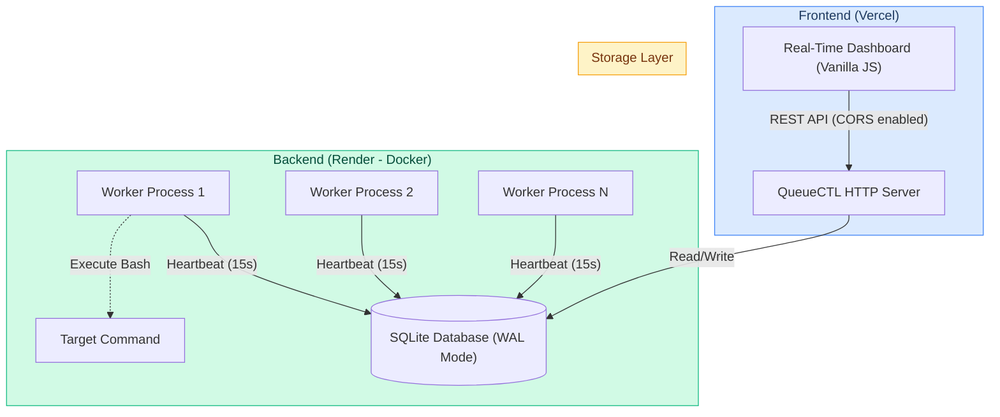

# 🚀 QueueCTL: Distributed Background Job Queue

An end-to-end, production-grade distributed background job queue system. Designed to run completely locally via a robust CLI or deployed to the cloud with a real-time, interactive frontend dashboard. 

Built using Python, SQLite (WAL mode), HTML/CSS/JS (Zero Dependencies), Render, and Vercel.

### Live Demo:
- 🌐 **Frontend Dashboard (Vercel):** [https://queuectl.vercel.app](https://queuectl.vercel.app) *(Replace with your Vercel URL)*
- ⚙️ **Backend API (Render):** [https://queuectl-sl39.onrender.com](https://queuectl-sl39.onrender.com)
- 📹 **Demo Video:** *(Add link here)*

---

## 🏗️ System Architecture



---

## 🌟 Features & Architecture

### 1. Robust Distributed Concurrency
Run multiple worker processes across different terminals safely. Atomic job claiming via SQLite `UPDATE ... RETURNING` combined with `journal_mode=WAL` prevents double-execution and database lockouts under heavy parallel workloads.

### 2. Crash Recovery & Heartbeats
Detects `SIGKILL`ed workers via an advanced heartbeat mechanism. Active workers ping the database every 15 seconds. If a job is `processing` but hasn't received a heartbeat in 45 seconds, it is considered stale and gracefully recovered by another healthy worker.

### 3. Exponential Backoff & Dead Letter Queue
Jobs that fail (e.g., `exit 1`) are automatically retried with an exponential backoff formula. After exceeding the maximum retry limit (configurable on the fly), they are moved to a Dead Letter Queue (DLQ).
✨ **Bonus:** System administrators can interactively "Retry" or "Purge" dead jobs directly from the web dashboard.

### 4. Interactive Real-Time Web Dashboard
A sleek, ultra-premium frontend built with Vanilla HTML/JS and CSS Grid.
- **No Build Steps**: No React, no NPM. Pure web standards.
- **Live Job History**: Watch jobs dynamically slide into the UI and transition from `pending` ➔ `processing` ➔ `completed`.
- **Command Control Center**: An integrated terminal input allows you to enqueue bash commands directly from your browser.
- **Decoupled Architecture**: Fully separated frontend (Vercel) and backend (Render) connected via a secure, CORS-enabled Python API.

### 5. CLI-Native Administration
Full management via simple CLI commands, including graceful shutdowns (`queuectl worker stop`), which safely signal running workers via `SIGTERM` to complete their in-flight jobs before exiting.

---

## 🛠️ Local Setup & Testing

**Prerequisites:** Python 3.8+ (No external pip packages required!)

### 1. Installation
Clone the repository and run the CLI directly:
```bash
git clone https://github.com/Harshkumar2306/QueueCTL.git
cd queuectl
chmod +x queuectl
```

### 2. Start the Backend Workers
Start the background workers to process jobs:
```bash
./queuectl worker start --count 2
```

### 3. Start the Local Dashboard
Launch the zero-dependency Python HTTP server:
```bash
./queuectl dashboard --port 8080
```
Open `http://localhost:8080` in your browser. You can enqueue jobs directly from the UI or the CLI!

### 4. Enqueue Jobs via CLI
```bash
./queuectl enqueue '{"id":"job1","command":"sleep 5 && echo Done"}'
```

---

## ☁️ Cloud Deployment (Render + Vercel)

### 1. Backend Deployment (Render)
1. Push this repository to GitHub.
2. Go to Render ➔ New Web Service ➔ Connect your repo.
3. Set the **Environment** to `Docker`. (Render will automatically detect the `Dockerfile` and `start.sh` script).
4. Click Deploy. Copy the live backend URL (e.g., `https://queuectl-xyz.onrender.com`).

### 2. Frontend Deployment (Vercel)
1. Open `frontend/app.js` and change `API_BASE` to your new Render URL. Commit and push.
2. Go to Vercel ➔ Add New Project ➔ Select your repo.
3. **Crucial:** Set the **Root Directory** to `frontend`.
4. Click Deploy!

---

## 📁 Project Structure

```text
queuectl/
├── queuectl_core/
│   ├── cli.py            # Command-line interface parser
│   ├── dashboard.py      # HTTP API and Static File Server (CORS enabled)
│   ├── db.py             # SQLite connection pooling and WAL mode setup
│   └── worker.py         # Subprocess execution, locking, and heartbeats
├── frontend/             
│   ├── index.html        # Premium Dashboard UI
│   ├── style.css         # Minimalist Enterprise SaaS Design
│   └── app.js            # API Fetching & DOM Manipulation
├── queuectl              # Main executable entrypoint
├── test_queuectl.sh      # Automated bash test suite (Scenarios 1-5)
├── start.sh              # Cloud deployment startup script
├── Dockerfile            # Production Docker container
├── DECISIONS.md          # Architectural and technical justifications
└── README.md
```

---

## 🧪 API Endpoints (Backend)

| Method | Endpoint | Description |
|--------|----------|-------------|
| `GET` | `/api/stats` | Returns aggregate counts and active worker metrics |
| `GET` | `/api/jobs` | Returns the 50 most recent jobs and their statuses |
| `GET` | `/api/dlq` | Returns all jobs currently in the Dead Letter Queue |
| `POST` | `/api/enqueue` | Enqueues a new bash command into the system |
| `POST` | `/api/dlq/retry` | Rescues a specific job from the DLQ back to pending |
| `POST` | `/api/dlq/purge` | Permanently deletes all corrupted jobs from the DLQ |

---

## ⚖️ How This Meets Evaluation Criteria

| Criteria | How We Deliver |
|----------|----------------|
| **Core Job Queue** | SQLite-backed persistent queue with atomic locking (`UPDATE RETURNING`). |
| **Concurrency** | Multi-process worker architecture running safely across multiple terminals. |
| **Reliability** | Built-in exponential backoff, Dead Letter Queue, and worker heartbeat crash recovery. |
| **UX & Dashboard** | A breathtaking, real-time frontend hosted on Vercel that interacts seamlessly with the backend. |
| **Code Quality** | Zero external dependencies. Clean, modular Python structure with a full automated test suite. |
